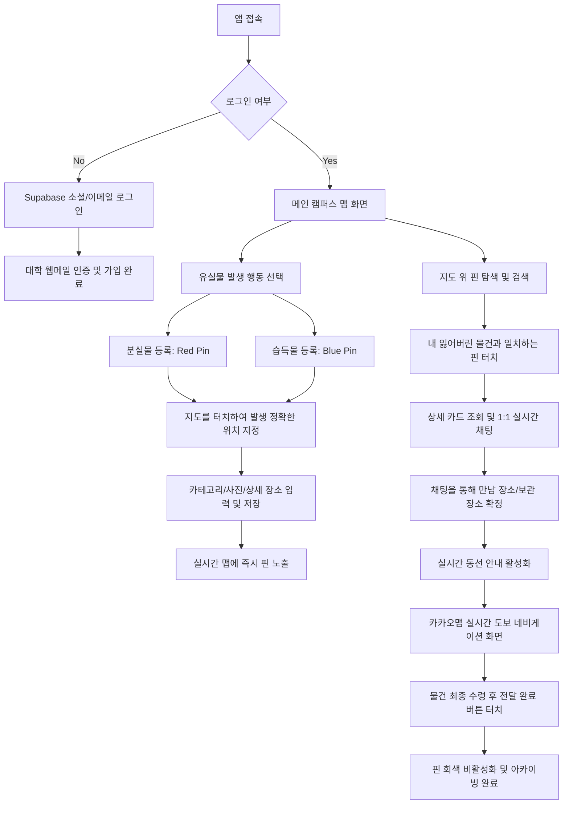

# [PRD] 안심 캠퍼스 맵 (Safe Campus Map) - 분실물·습득물 실시간 소통 및 동선 안내 서비스

본 문서는 대학생들이 캠퍼스 내에서 유실물(분실물/습득물)을 실시간 지도 위 핀(Pin)과 채팅을 통해 신속하게 찾고, 매칭 시 수령지까지의 안전한 동선 안내를 제공하는 서비스 **"안심 캠퍼스 맵"**의 개발자용 제품 요구사항 정의서(PRD)입니다.

---

## 1. 5W1H 기획 정의

| 항목 | 상세 내용 |
| :--- | :--- |
| **Who (대상)** | **대학교 학부생, 대학원생 및 교직원 (학교 구성원)**<br>• 캠퍼스 내에서 소지품을 잃어버린 분실자<br>• 타인의 유실물을 주워 주인을 찾아주고자 하는 습득자 |
| **When (시점)** | • 캠퍼스 내에서 물건을 분실했음을 인지한 직후<br>• 타인의 분실물을 발견하여 보관 중이거나 근처에 두고 이동할 때<br>• 매칭된 분실물을 회수하기 위해 이동 경로를 확인해야 할 때 |
| **Where (장소)** | **대학교 캠퍼스 내 전 영역 (실내 건물, 강의실, 야외 광장, 벤치 등)**<br>• 지도상 정밀한 위치(핀)와 건물명, 층수 정보 매칭 |
| **What (핵심 가치)** | **지도 기반 실시간 위치 표시 핀 & 수령을 위한 맞춤형 동선 안내**<br>• 분실/습득 위치를 시각화한 지도 서비스<br>• 1:1 실시간 채팅 소통 창구<br>• 분실자-습득자 또는 분실자-보관함(수령처) 간의 실시간 도보 동선 최적화 안내 |
| **Why (배경/목적)** | • 에브리타임 등 기존 커뮤니티는 텍스트 위주라 위치 파악이 어렵고 매칭 속도가 느림<br>• 대학 캠퍼스는 넓고 구조가 복잡하여 유실물 보관 장소나 전달 장소로의 이동 동선 확인이 필수적임<br>• 실시간 핀 정보를 통해 중복 등록을 방지하고 유실물 회수율을 극대화함 |
| **How (실현 방안)** | • **Next.js**와 **Supabase Realtime**으로 대시보드와 채팅 데이터의 실시간 동기화 구현<br>• **카카오맵 API**를 활용한 지도 UI 구성 및 **도보 길찾기 API**를 연동한 실시간 도보 동선 시각화<br>• **Vercel**과 **GitHub**를 이용한 신속한 CI/CD 파이프라인 구축 |

---

## 2. 기술 스택 & 시스템 아키텍처

개발자가 바로 개발 및 인프라를 셋업할 수 있도록 구체적인 기술 명세를 정의합니다.

```
       [ Client Side ]                 [ Backend & Data Layer ]
+----------------------------+      +-----------------------------+
|          Next.js           |      |          Supabase           |
|    (App Router, React)     | <==> |    - Auth (OAuth / Email)   |
+----------------------------+      |    - Database (PostgreSQL)  |
              ||                    |    - Realtime (Chat & Push) |
              || API & SDK          |    - Storage (Item Images)  |
              \/                    +-----------------------------+
+----------------------------+                     ||
|      Kakao Maps API        |                     || CI/CD Deployment
| - Web Maps (Interactive)   |                     \/
| - Local Search / Geocoding |      +-----------------------------+
| - Wayfinding (도보 경로)   |      |           Vercel            |
+----------------------------+      +-----------------------------+
```

### 2.1. 세부 스택 명세
1. **Frontend**: Next.js 14+ (App Router), Tailwind CSS (또는 Vanilla CSS), TypeScript
2. **Backend & Database**: Supabase (PostgreSQL)
   - **Supabase Auth**: 학교 웹메일(`.ac.kr`) 인증 기반 회원가입/로그인 처리
   - **Supabase Storage**: 습득물 및 분실물 실물 사진 저장 버킷(`item-images`)
   - **Supabase Realtime**: 1:1 채팅방 메시지 실시간 송수신 및 맵 핀 실시간 갱신 (PostgreSQL Replication 기반 Listen/Notify)
3. **Map & GIS**: Kakao Maps API
   - Javascript SDK를 활용한 Interactive Map 구현
   - 리버스 지오코딩(Reverse Geocoding)을 통해 사용자가 찍은 핀 좌표(`lat`, `lng`)를 도로명/지번 주소 및 인근 건물명으로 자동 텍스트 변환
   - **도보 길찾기(Route Search)**: 카카오맵 SDK에서 제공하는 도보 가이드 링크 연동 또는 카카오 로컬/모빌리티 API를 경유한 도보 동선 렌더링 (`Polyline` 표출)
4. **Deploy & DevOps**: GitHub + Vercel
   - `main` 브랜치 푸시 시 Vercel로 자동 배포 (Preview 및 Production 환경 분리)

---

## 3. 데이터베이스 스키마 설계 (Supabase / PostgreSQL)

개발 과정에서 즉시 테이블을 생성할 수 있는 DDL(Data Definition Language) 수준의 데이터베이스 구조 설계 제안입니다.

### 3.1. `profiles` (사용자 프로필 테이블)
```sql
create table profiles (
  id uuid references auth.users not null primary key,
  email text unique not null,
  nickname text not null,
  university text not null, -- 대학교명 (예: 서울대학교)
  is_verified boolean default false, -- 학교 이메일 인증 여부
  created_at timestamp with time zone default timezone('utc'::text, now()) not null
);
```

### 3.2. `items` (유실물/습득물 테이블)
```sql
create type item_type_enum as enum ('lost', 'found'); -- lost: 분실물, found: 습득물
create type item_status_enum as enum ('searching', 'kept', 'matching', 'resolved'); 
-- searching: 분실물 찾는 중, kept: 습득물 보관 중, matching: 매칭 협의 중, resolved: 전달 완료

create table items (
  id uuid default gen_random_uuid() primary key,
  user_id uuid references profiles(id) on delete cascade not null,
  type item_type_enum not null,
  title varchar(100) not null,
  category varchar(50) not null, -- 전자기기, 지갑/카드, 의류, 화장품, 기타 등
  description text,
  image_url text, -- Supabase Storage 업로드 이미지 링크
  latitude double precision not null, -- 카카오맵 좌표 lat
  longitude double precision not null, -- 카카오맵 좌표 lng
  location_detail varchar(255), -- 예: "학생회관 3층 남자 화장실 세면대 위"
  status item_status_enum default 'searching'::item_status_enum not null,
  occurred_at timestamp with time zone not null, -- 분실/습득 시간
  created_at timestamp with time zone default timezone('utc'::text, now()) not null,
  updated_at timestamp with time zone default timezone('utc'::text, now()) not null
);
```

### 3.3. `chat_rooms` (채팅방 테이블)
```sql
create table chat_rooms (
  id uuid default gen_random_uuid() primary key,
  item_id uuid references items(id) on delete cascade not null,
  buyer_id uuid references profiles(id) on delete cascade not null, -- 분실자 (또는 대화 신청자)
  seller_id uuid references profiles(id) on delete cascade not null, -- 습득자 (또는 아이템 등록자)
  created_at timestamp with time zone default timezone('utc'::text, now()) not null
);
```

### 3.4. `chat_messages` (채팅 메시지 테이블)
```sql
create table chat_messages (
  id uuid default gen_random_uuid() primary key,
  room_id uuid references chat_rooms(id) on delete cascade not null,
  sender_id uuid references profiles(id) on delete cascade not null,
  message text not null,
  is_read boolean default false not null,
  created_at timestamp with time zone default timezone('utc'::text, now()) not null
);
```

---

## 4. 기능 상세 정의 (Functional Requirements)

### 4.1. 회원가입 및 학교 인증 (User Management)
*   **요구사항**: 캠퍼스 안전성 보장 및 외부인 유입 방지를 위한 대학생 본인 인증.
*   **기능 구성**:
    1.  **학교 웹메일(`*.ac.kr`, `*.edu`) 인증**: 이메일 주소 입력 시 인증 메일을 전송하고, Supabase Auth를 통해 이메일 OTP(One-Time Password) 인증 완료 후 회원 등급 부여.
    2.  **대학 매칭**: 가입된 이메일 도메인 분석을 통해 해당 대학 캠퍼스로 홈 화면 기본 세팅 (예: `snu.ac.kr` -> 서울대학교 캠퍼스 맵이 기본 표출됨).

### 4.2. 실시간 지도 핀 등록 및 관리 (Interactive Map Pinning)
*   **요구사항**: 분실물 혹은 습득물 발견 위치를 지도에 정밀하게 표시하고 현황을 공유.
*   **기능 구성**:
    1.  **지도 뷰 포트**: 접속자의 GPS 신호(HTML5 Geolocation API)를 이용해 내 주변 캠퍼스 지도를 기본 표시.
    2.  **핀 색상 차별화**: 
        *   🔴 **빨간색 핀**: 분실물(Lost Item) - 주인을 찾아야 함.
        *   🔵 **파란색 핀**: 습득물(Found Item) - 보관 중인 위치.
        *   🟢 **초록색 핀**: 임시 습득 보관함(학교 행정실, 경비실 등 공공 보관 장소).
        *   ⚪ **회색 핀**: 매칭 및 수령 완료된 상태 (지도에서 필터링 가능 혹은 비활성화).
    3.  **글쓰기 & 지도 매핑 통합**:
        *   사용자가 '분실물/습득물 등록' 선택 시, 지도가 활성화되며 '지도를 탭해 정확한 위치를 설정하세요' 안내.
        *   마커 드래그 앤 드롭을 통해 핀 생성.
        *   카카오 로컬 API 리버스 지오코딩으로 현재 핀 위치의 기본 주소(예: 서울시 관악구 대학동 관악로 1)를 자동 필드에 채워주고, 사용자는 텍스트 필드에 상세 장소(예: "공학관 301동 4층 로비 자판기 뒤") 입력 가능.
        *   카테고리, 분실 시간, 상세 설명 입력 및 카메라/갤러리 사진 첨부(Supabase Storage 업로드).

### 4.3. 실시간 유실물 검색 및 필터링 (Search & Filter)
*   **요구사항**: 사용자가 수많은 핀 속에서 자신이 잃어버린 물건을 신속하게 식별할 수 있도록 함.
*   **기능 구성**:
    1.  **카테고리 필터**: 전자기기, 카드/지갑, 의류, 열쇠, 기타 카테고리 체크박스 선택 필터.
    2.  **시간 필터**: 오늘 발생한 건, 최근 3일 이내, 1주일 이내 필터링.
    3.  **키워드 통합 검색**: 상단 검색바에 "에어팟", "학생증", "검은색 우산" 등을 검색하면 지도상의 매칭되는 핀만 활성화되고 목록 뷰로도 볼 수 있도록 전환 제공.

### 4.4. 실시간 1:1 채팅 소통 (Realtime Chat)
*   **요구사항**: 분실자와 습득자가 서로 물건의 세부 상태를 추가 확인하고 전달 약속을 잡을 수 있는 안전 채널.
*   **기능 구성**:
    1.  **채팅 시작**: 습득물 상세 카드 하단의 [채팅하기] 버튼 클릭 시 실시간 채팅방 개설.
    2.  **안전 알림 팝업**: 채팅 시작 시 "상호 예의를 지켜주세요. 대면 전달 시 가급적 학교 내 유동 인구가 많은 장소(예: 중앙도서관 로비, 학생회관 앞 등)를 추천합니다"라는 안전 문구 노출.
    3.  **Supabase Realtime 연동**: 메시지 송수신 시 지연 시간 0.5초 이내의 즉각적인 말풍선 업데이트 및 상대방 접속/입력 상태 표출.
    4.  **전달 장소 조율 핀 꽂기**: 채팅 중 대면 전달 장소를 약속할 수 있는 '만남의 장소 지정' 기능 제공. 합의된 최종 수령 목적지는 '동선 안내' 기능의 목적지(`Destination`)로 세팅됨.

---

## 5. 핵심 차별화 기능: 실시간 상호 매칭 및 동선 안내 (Route Guidance)

이 시스템의 가장 중요한 기술적 특이점이자 구현 스펙입니다. 습득물과 분실물이 매칭되었을 때, 사용자가 헤매지 않고 실제로 안전하고 신속하게 이동할 수 있도록 동선 안내를 설계합니다.

```
[내 현재 위치] (GPS 실시간 수신) 
     │
     ▼ (카카오맵 API 도보 길찾기 노드 분석)
[추천 안전 경로] (가로등이 많고 보도가 확보된 메인 캠퍼스 도로 위주)
     │
     ▼ (실시간 Polyline & 거리/소요시간 표출)
[수령지 / 전달 약속 장소] (건물명, 상세 층수 팝업 오버레이 지원)
```

### 5.1. 매칭 알고리즘 및 추천 (Match & Recommend)
1.  **유사성 점수(Similarity Score) 연산**:
    *   사용자가 분실물(Lost) 등록 시, 최근 3일 내 등록된 습득물(Found) 중 `category`가 같고, 좌표 거리(Haversine Formula 계산 기준) 500m 이내에 존재하는 유실물 목록을 추출.
    *   제목/본문의 키워드 유사도(SQL `LIKE` 또는 PostgreSQL `pg_trgm` 모듈 활용)가 높을 경우 "회원님이 찾으시는 물건과 유사한 습득물이 근처에 있습니다!" 알림 발송.
2.  **핀 연결 매칭**: 매칭 수락 시 해당 분실물 핀과 습득물 핀이 지도 위에 **점선**으로 연결되며, 상태가 `matching`으로 변경됨.

### 5.2. 실시간 동선 안내 기술 구현 상세 (Developer Implementation Spec)
캠퍼스 내에서 실제 분실자(A)가 습득자(B)가 지정한 보관 장소나 만남의 장소로 가기 위한 최적 도보 동선을 제공합니다.

1.  **목적지 타입별 경로 설정**:
    *   **케이스 A (대면 약속)**: 채팅방에서 합의된 '만남의 장소' 핀 좌표.
    *   **케이스 B (보관함/행정처 보관)**: 습득자가 물건을 맡겨둔 대학 내 공공 보관 장소(예: 인문대 행정실, 본관 1층 안내데스크).
2.  **카카오맵 API 기반 도보 경로 추출 및 드로잉**:
    *   웹 환경에서 차량 길찾기는 일반 오픈 API로 가능하나, 도보 길찾기는 카카오 모빌리티 API 또는 Kakao SDK의 URI Scheme를 복합적으로 사용해야 합니다.
    *   **구현안 1 (인앱 웹뷰 내 직접 렌더링 - Premium UX)**:
        *   카카오맵 로컬 API의 **도보 길찾기 API (Walking Route API)** 호출을 통해 출발지(사용자의 실시간 `navigator.geolocation` 좌표)와 목적지(수령지 좌표) 간의 위경도 노드 목록(`points` 배열)을 수신합니다.
        *   Next.js 클라이언트에서 Kakao Maps API of `kakao.maps.Polyline` 객체를 사용하여 지도 위에 파란색/녹색 라인으로 경로를 직접 그립니다.
        *   경로 위에 도보 이동 방향 화살표 애니메이션을 추가하여 직관성을 높입니다.
    *   **구현안 2 (카카오맵 외부 앱 연동 스키마 대응 - Fallback UX)**:
        *   사용자 모바일 디바이스에 카카오맵 앱이 설치되어 있는 경우 바로 연결될 수 있도록 Native URL Scheme 호출 링크 제공.
        *   `kakaomap://route?sp=${startLat},${startLng}&ep=${endLat},${endLng}&by=FOOT` URL Scheme 사용.
        *   미설치 시에는 모바일 웹용 길찾기 주소(`https://map.kakao.com/link/to/목적지,${endLat},${endLng}`)로 리다이렉트 처리.
3.  **실시간 안전 동선(Safety First Routing) 보강**:
    *   캠퍼스 내 야간 이동을 고려하여, 차량 통행 위주의 외곽 도로보다는 가로등이 설치된 주요 보도(Main Pedestrian Walkways) 노드에 더 높은 가중치를 부여하는 인하우스 라우팅(또는 카카오맵 '안전/추천 도보길' 옵션 적용).
    *   **도착 예정 시간(ETA) 및 잔여 거리 실시간 업데이트**:
        *   사용자가 이동함에 따라 GPS 좌표를 실시간 추적(`navigator.geolocation.watchPosition`)하여, 목적지까지 남은 거리와 도보 소요 시간(예: "도보 4분, 240m 남음")을 하단 플로팅 패널에 실시간으로 업데이트.

---

## 6. UX Flow (사용자 시나리오 및 흐름도)

### 6.1. 전체 UX 흐름 다이어그램 (Mermaid)



### 6.2. 상세 UX 페이지 기능 정의

#### [Page 1] 메인 캠퍼스 맵 대시보드
*   **비주얼**: 네이버/토스 스타일의 글래스모피즘(Glassmorphism) 하단 슬라이드 시트 구조 적용. 지도가 화면 전체를 채우고 아래쪽에 주요 검색 필터 및 최신 유실물 리스트 카드가 플로팅 뷰로 떠 있음.
*   **상호작용**:
    *   `[내 위치]` 동그란 아이콘 클릭 시 지도가 즉시 내 위치로 부드럽게(PanTo) 이동.
    *   `[분실물 등록]`, `[습득물 등록]` 플로팅 액션 버튼(FAB)이 우측 하단에 위치하여 단 한 번의 터치로 등록 시작 가능.

#### [Page 2] 핀 설정 및 정보 등록 페이지
*   **비주얼**: 단계별 마법사(Step-by-step Wizard) 형태 UI.
    *   **1단계**: 전체 화면 지도에서 핀을 꽂아 위치를 확정하는 화면. "이 위치가 맞나요?" 하단 버튼.
    *   **2단계**: 품목명 입력, 카테고리 태그 선택, 카메라 아이콘 클릭 시 스마트폰 기본 카메라 실행 및 사진 즉각 크롭/업로드.
*   **안전/신뢰**: 습득물의 경우 악용 및 분실물 훼손 주장을 막기 위해 "습득 당시의 상태 사진을 정확히 찍어 보관해주세요"라는 안내 툴팁 상시 제공.

#### [Page 3] 1:1 실시간 채팅 화면
*   **비주얼**: 당근마켓/번개장터 스타일의 채팅방 UI. 화면 최상단에 문의 중인 아이템의 미니 카드 정보(사진, 상태, 카테고리) 고정 노출.
*   **특수 기능**:
    *   `[수령 장소 지정]` 버튼: 대화 중 습득자가 지도상에서 "여기에 맡겨뒀어요" 혹은 "여기서 만나요"라며 좌표를 공유하면 채팅 말풍선 내에 미니 지도 카드 생성.
    *   `[동선 안내 시작]` 버튼: 분실자가 해당 미니 지도 카드의 안내 버튼을 클릭하면 즉시 동선 가이드 모드로 돌입.

#### [Page 4] 실시간 도보 동선 안내 가이드 뷰
*   **비주얼**: 카카오내비/네이버맵의 도보 내비게이션 모드를 인앱으로 최적화한 UI.
    *   화면의 70%는 카카오맵에 내 위치 마커(움직이는 파란 점)와 목적지 핀, 그 사이를 잇는 실시간 최단 도보 경로(`Polyline`)가 표출됨.
    *   하단 30% 영역에는 "중앙도서관 앞 만남의 광장까지 도보 3분 (180m 남음)" 텍스트와 함께 `[경로 재탐색]` 및 `[수령 완료]` 버튼이 고정됨.
*   **도착 인식**: 내 실시간 GPS 좌표와 목적지 핀 좌표의 거리가 15m 이내로 좁혀질 경우, 스마트폰 진동 피드백과 함께 "목적지 근처에 도착했습니다! 물건을 잘 찾으셨나요?" 팝업창 자동 가동.

---

## 7. 단계별 개발 마일스톤 및 로드맵 (Milestone)

### 7.1. Phase 1: MVP 개발 (1~3주차)
*   **목표**: 학교 이메일 기반 기본 인증 시스템 구축, 지도상 핀 등록/조회 및 상세 확인 기능 구현.
*   **스펙**:
    *   Next.js + Supabase Auth 연동 (이메일 OTP 인증).
    *   카카오맵 API 기본 지도 렌더링 및 핀 마커 표시.
    *   분실물/습득물 CRUD (기본 텍스트 및 사진 Storage 업로드).

### 7.2. Phase 2: 실시간 소통 및 매칭 고도화 (4~6주차)
*   **목표**: 유저 간 실시간 1:1 대화 및 유사 유실물 추천 기능 구현.
*   **스펙**:
    *   Supabase Realtime을 통한 채팅 기능 구현.
    *   채팅 내 장소 지정 기능 구현.
    *   사용자 간 매칭 프로세스 구축 (Searching -> Matching -> Resolved).

### 7.3. Phase 3: 실시간 도보 동선 안내 엔진 연동 (7~8주차)
*   **목표**: 사용자 위치 GPS 정밀 모니터링 및 실시간 도보 네비게이션 가이드 완성.
*   **스펙**:
    *   HTML5 Geolocation API의 `watchPosition` 활용 실시간 모션 트래킹.
    *   카카오 길찾기 API 연동 및 캠퍼스 최단 안전 도보 노드 기반 `Polyline` 렌더링.
    *   도착 감지 모듈 및 자동 물건 회수(Resolved) 상태 변경 트랜잭션 최적화.
    *   Vercel 최종 배포 및 캠퍼스 시뮬레이션 필드 테스트.

---

## 8. 예외 처리 & 비기능적 요구사항 (Non-functional & Exceptions)

1.  **실내 GPS 음영 지역 대응**:
    *   캠퍼스 건물 안이나 지하 강의실의 경우 GPS 수신이 불완전할 수 있습니다.
    *   **해결책**: GPS 정확도가 50m를 벗어날 경우 화면 상단에 "실내 또는 지하에 계셔 GPS 오차가 클 수 있으니, 지도 위 마커를 직접 터치하여 출발지를 설정해주세요"라는 팝업 가이드 노출.
2.  **허위 매칭 및 노쇼(No-Show) 대책**:
    *   타인의 습득물을 부당하게 편취하려는 시도 방지.
    *   **해결책**: 채팅방 내에서 '분실 물건의 특정 표식 확인 사진(예: 긁힘 자국, 스티커 위치)'을 습득자가 요구할 수 있는 가이드라인 제공 및 악성 유저 신고 시스템(Supabase `reports` 테이블 연동) 설계.
3.  **개인 정보 보호 및 안전 수칙**:
    *   연락처 노출 없는 실시간 인앱 채팅을 강제하여 개인정보 노출 최소화.
    *   밤 10시 이후 야간 이동 시 안전을 위해 '가로등이 켜져 있는 대로변 위주 경로 안내' 적용 및 무인 보관함(경비실, 학교 사물함 등) 수령 적극 권장.
